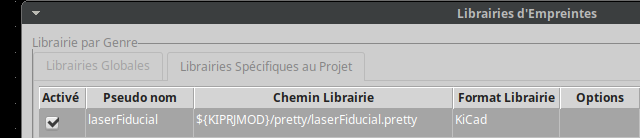
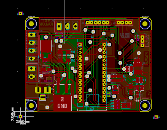

# laser Fiducial

Fiducial footprint library for kicad

### Installing

Place the footprint (laserFiducial.pretty) directory in your kicad projet directory. 
Add the library to your project as Specific library.

Then add three fiducial around your board to form an L : left upper corner, left lower corner, right lower corner.
Distance form the edge : 3mm for automatic clipping path, 2mm if no clipping. 

## Authors

* **Philippe Arlotto** 

## License

This project is licensed under the GPL licence

 

